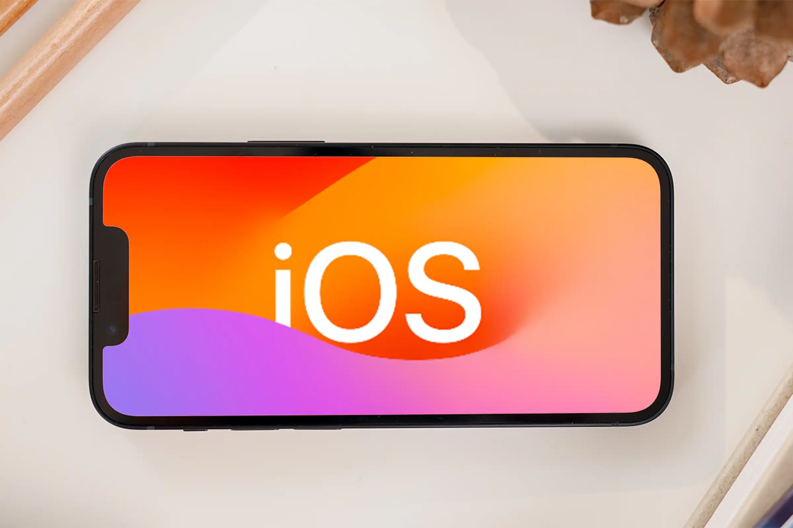

# QND Computer Science Day 15
Mr. Schmidt

--- 

# DOWNLOAD SWIFT PLAYGROUNDS

We'll need it today!

---

# Swift Playgrounds

- Apple-made app
- Learn Swift
- 3 major modes

---

# Playgrounds

- Very similar to our Replit environments!
- Write Swift code and run it
- Cannot receive input from the user 😡

---

# Lessons

- Interactive environments
- Guided coding
- Some of the best self-teaching materials
- Free!

---

# Apps

- Develop actual iOS apps on iPad
- Release on the App Store!
  - No need for Xcode

---

# iOS 

- Operating System for iPhones, iPads

--- 

# iOS Apps

- App Store launched in 2008 alongside the iPhone 3G
- Originally written in Objective-C using UIKit
- Apple released Swift in 2014 as a more modern alternative
- Added SwiftUI in 2019

---

# SwiftUI

- UI = User Interface
- "Declarative"
- Simpler to write
- Works across iOS, tvOS, watchOS, macOS, and soon visionOS

---

# SwiftUI

- Simple building blocks
- Common experience across all apps
  - No need to reinvent the wheel for each app
- Built-in accessibility

---

# Let's Get Coding

- Buttons
- Guess My Number
