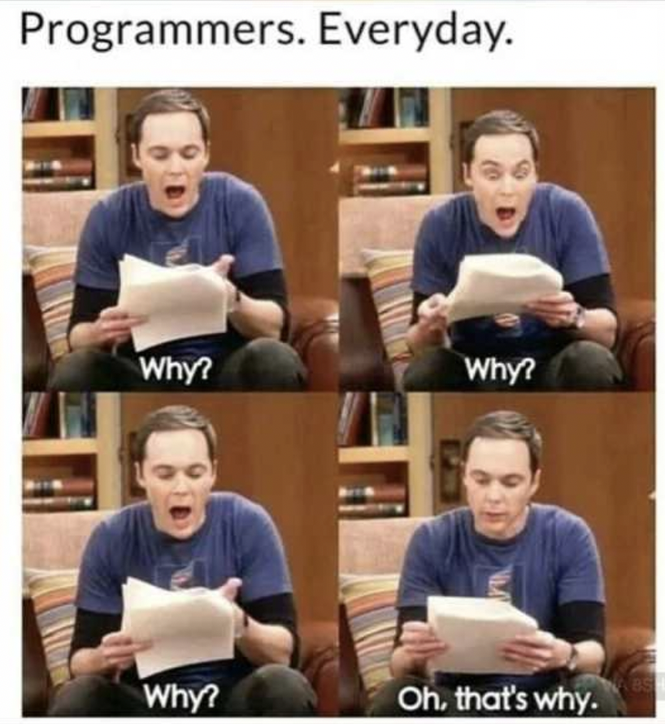

# QND Computer Science Day 0
Mark Schmidt

--- 

# Welcome!

- Agenda
    - Introduction
    - What is this class?
    - Why should you care?
    - The Basics
    - Activity

---

# Introduction

- University of Illinois
- Microsoft
- Ocient
- Google
- Side Projects
    - Fidgets
    - Scoreboard

---

# What is this class?

- Fundamentals
    - Tools for success
- Get feedback
- Include *everyone

<!-- -->
<!-- When I pitched this class, originally it was just for students who wished to learn about CS -->
---

# Why CS?

- Career
    - High demand
    - Great benefits
- Fun
    - Creative problem solving
    - Satisfaction
- Understanding
    - The world is digital!

<!-- -->
<!-- Even if you're not a computer person or a science person, you might find you enjoy the problem solving aspects! -->
<!-- Any questions on what we're doing? -->

---

# Questions?

---

# Program

- A series of instructions for a computer to execute

---

# Problem Solving

- The computer does *exactly* what you tell it to
- Making mistakes and learning is part of the fun!

--- 

# Activity

- Write a program to make a PB + J sandwich
- I will execute it
- Groups of 3

### BE SPECIFIC