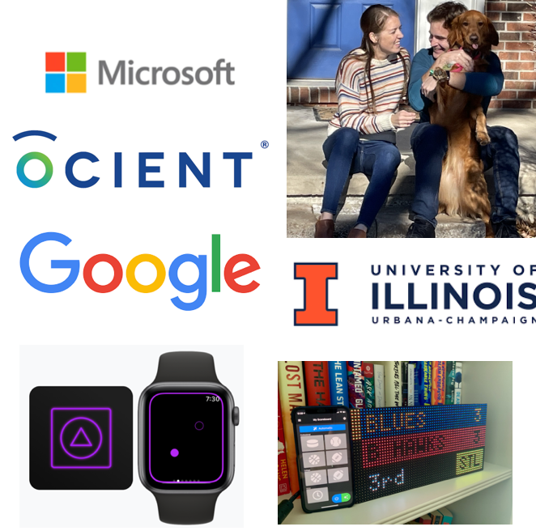

# QND Computer Science Day 0
Mr. Schmidt

--- 

# Welcome!

- Agenda
    - Who am I?
    - Why am I here?
    - Why should you care about Computer Science?
    - Activity

---

# Introduction

- University of Illinois
- Microsoft
- Ocient
- Google
- Side Projects
    - Fidgets
    - Scoreboard
    - Planetary Lifts

---

# Why am I here?

- Computer Science can be hard to self-teach
- CS is for everyone!
    - Have an open mind

<!-- -->
<!-- Computer science can be really hard to self-teach -->

<!-- When I pitched this class, originally it was just for students who wished to learn about CS -->

---

# What will we be doing?

- 4 Weeks of intro to Computer Science
    - Swift
- Games
- Wordle
- Code Art
- **No homework!**

---

# Why CS

- 3 reasons

---

# Why CS? 

- Fun
    - Creative problem solving
        - Every program is a puzzle
    - Artistic expression

---
# Why CS?

- Great Careers
    - You should be thinking about career options
    - Software engineers are in high demand
        - High pay, great benefits
- Differentiator for any field!

---

# Why CS?

- Understanding
    - Huge societal impacts of technology
    - Protection from scams and bad actors
- Problem Solving Skills
    - Critical thinking

<!-- -->
<!-- Even if you're not a computer person or a science person, you might find you enjoy the problem solving aspects! -->

---

# Questions?

<!-- -->
<!-- Any questions on what we're doing? -->
<!-- What's my role at Google like? -->
<!-- What are my hot takes on recent technology developments -->
<!-- How did I know that Software Engineering was right for me? -->

---

# Your First Program!

- We will write many programs
- Programs are kind of like recipes
- Give the computer instructions, it performs them
- Computers are dumb
- It does *exactly* what you tell it to do

--- 

# Your First Program!

- Write a "program" to make a PB + J sandwich
- I will execute it
- Groups of 3

# BE SPECIFIC

---

# ROUND TWO

- Let's fix our problems together