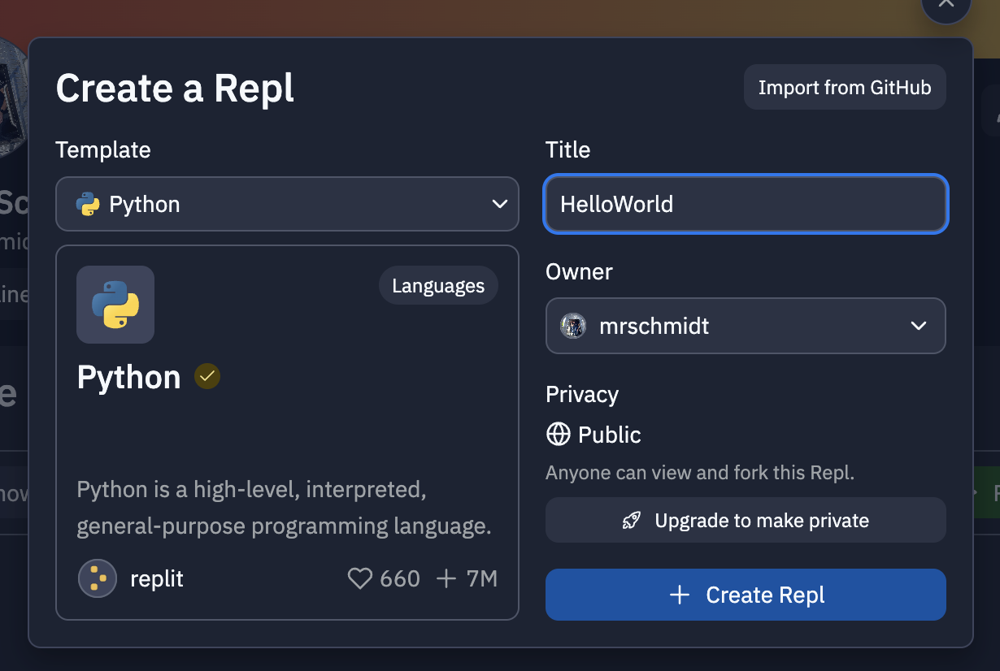
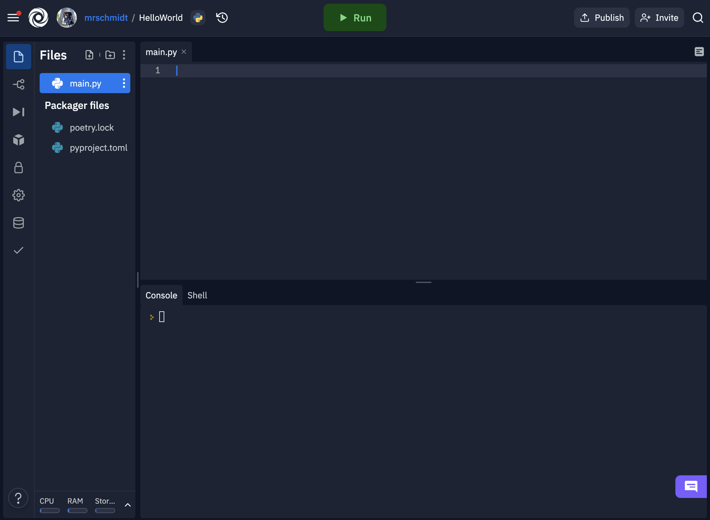

# QND Computer Science Day 1 
Mark Schmidt

---

# Agenda

- Programming Languages
- Python
- Replit
- Your first (actual) program

---

# Programming Languages

- Many different ways to tell a computer what to do
- Advantages and disadvantages
- Fast vs. convenient
- Simple vs. complex


---

# Python

- **Simple**, batteries included language
- Used by real engineers!
  - Machine learning
  - Web services
  - Scripting
- A great **starting point**


--- 

# Replit

- We need a coding environment
- **Replit** is an online Integrated Development Environment
- Skip installation/package management/local device issues 

---

# Setup

1. Create an account (use your Google account)
2.  Press "+" in the top right
3.  Select **Python** as a template
4.  Title **Hello World**
5.  Press "Create REPL"


---



---

# Hello World!

In **main.py**, write:

```python
greeting = "Hello World"
print(greeting)
```

Then tap the **▶️ Run** button on top

You should see `Hello World` in the console below

---

# Hold on, what?

- `"Hello World"` is a **string**
  - A string is a list of **characters** between quotes `"`
  - A string can by empty `""`
- We store the string in a variable called `greeting`
- `print()` is a **function**
  - A function takes some inputs (between parens) and produces some outputs
  - `print(value)` will print the value  
- Can you change your program to greet yourself? 

---

# Variables 

```python
greeting = "Hello World!"
print(greeting)
```
- We **assign** the string `"Hello World!"` to the variable `greeting`
- We **pass** `greeting` to `print` as its input
- We can **reuse** greeting multiple times
  - Can you print `"Hello World"` three times?

---
# What will this do?

```python
name = "Luna"
print("Hello" + name)
```

<!-- -->
<!-- Gotcha: will print out "HelloLuna"
We need to add a space -->
<!-- + is the concatenation operator -->

---
# This program is boring!

- It needs to respond to user input
- Use the `input()` function!
- Input *optionally* takes in a string to output
- Waits for user input *in the console*
- Type your name and press enter key

```python
name = input("What is your name?")
```
- Use concatenation to greet the user!

---

# Extra Challenges

- Ask a user for their name and their favorite emoji. Greet them, and print their favorite emoji three times
- Print empty lines between each line of output
  - What happens if we pass `""` to `print`?