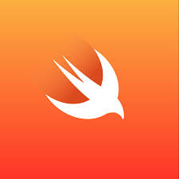
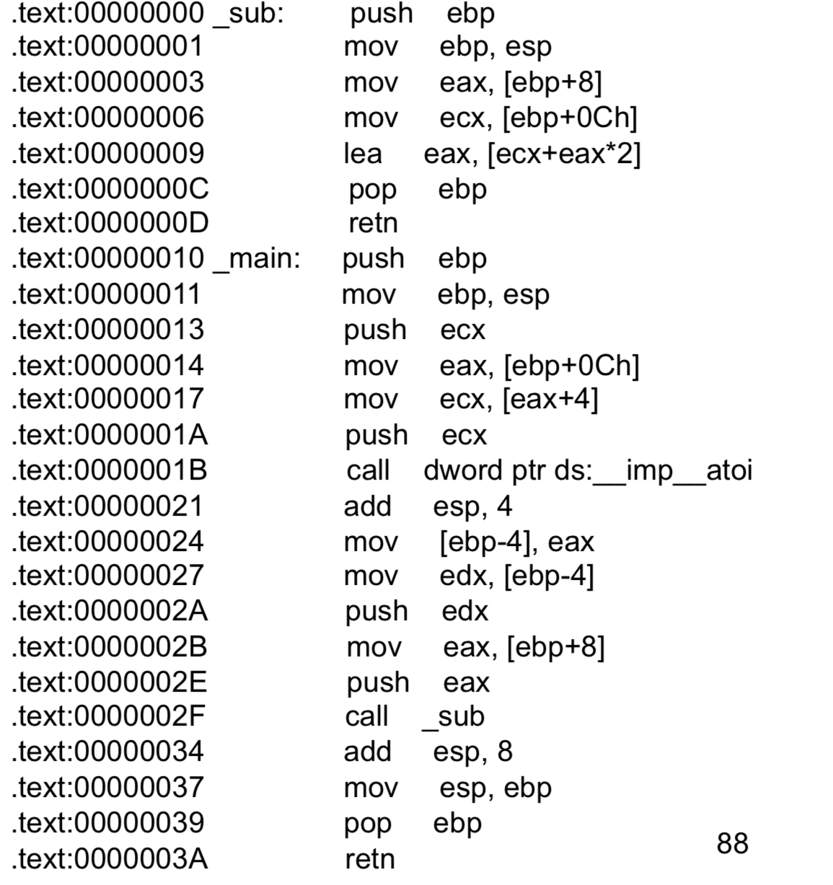
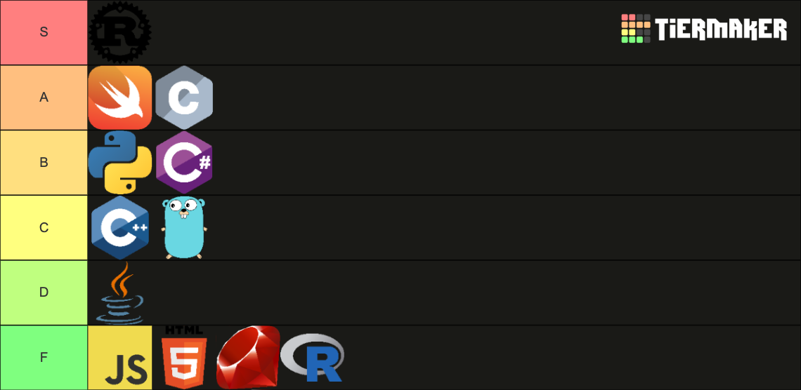
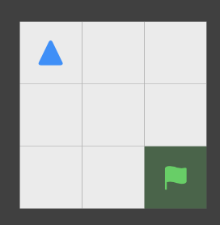

# QND Computer Science Day 1 
Mr. Schmidt

---

# DOWNLOAD SWIFT PLAYGROUNDS NOW


---

# Agenda

- Expectations
- Programming Languages
- Swift
- Tools
- Your first (actual) program

---

# Expectations

- You will not master everything today
- You will (probably) be lost
- That's okay!


--- 

# Expectations

- Practice, practice, practice
- Help each other!
- Today will be slower and more boring than normal
- Bear with me!

---

# Machine Code 

- Hard to write and understand
- Different computer types use different machine code


---

# Programming Languages

- *Compile* to machine code
- Many, many different languages

---



---
# Swift

- Programming Language created by Apple
- Used for creating iOS and macOS applications
- Simple and modern!


--- 

# My Website

- Everything you need is at [markschmidt.io/qnd]()
- Presentation slides
- Code links

---

# Swift Playgrounds

- We need a coding environment
- We'll use Swift Playgrounds
- Normally for iOS App Development
- Use a template to do simple starter coding

---

# Setup

- Go to [markschmidt.io/qnd](markschmidt.io/qnd)
- Click the "Download Template" button
- Open the file in the Files app
- Unzip
- Open the Playground

---

# Why is this so complicated?

- Apple is dumb
- I am very mad

---

# Robots!

- Move a robot around a virtual world
- Reach the end gate
- 8 different levels

---

# Robot Commands

- robot.forward()
- robot.turnRight()
- robot.turnLeft()
- robot.wait() 
- Don't touch a wall or it's game over!
---

# What does all this mean?

- `robot` is a reference to the robot on the screen
- `.` tells the program to apply the function to the robot
- `forward`, `turnRight`, etc. are the names of functions that tell the robot what to do
- `()` means to execute the function
  - Later, we'll see functions with inputs, which will go inside the parentheses

--- 

# Level 1

- Turn right
- Move forward twice
- Turn right
- Move forward twice

```
robot.turnRight()
robot.forward()
robot.forward()
robot.turnRight()
robot.forward()
robot.forward()
```



---

# Level 2

- More complicated movement!

---

# Level 3

- Keys!
- Go get the key, then go through the lock to the end

---

# Level 4

- Enemies!
- Avoid the enemies by waiting for them to pass
- Enemies move when you move
- If you touch them, game over
- Use `robot.wait()` to wait for an enemy to pass

---

# Level 5

- Lasers!
- Periodically turn on and off

---

# Level 6

- Teleporters
- Go through the teleporter to get to the end

---

# Level 7

- More lasers!

---

# Level 8

- Putting it all together


