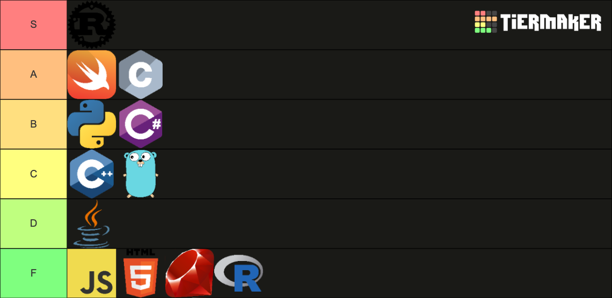

# QND Computer Science Day 1 
Mr. Schmidt

---

# Agenda

- Learning philosophy
- Programming Languages
- Swift
- Tools
- Your first (actual) program

---

# Learning Philosophy

- You will not master everything today
- You will (probably) be lost
- That's okay!
- Practice, practice, practice
- Help each other!

---

# Machine Code 

- Hard to write and understand
- Different computer types use different machine code


---

# Programming Languages

- *Compile* to machine code
- Many, many different languages

---



---
# Swift

- Programming Language created by Apple
- Used for creating iOS and macOS applications
- Simple and modern!


--- 

# My Website

- Everything you need is at [markschmidt.io/qnd]()
- Presentation slides
- Code links

---

# Swift Playgrounds

- We need a coding environment
- We'll use Swift Playgrounds
- Normally for iOS App Development
- Use a template to do simple starter coding

---

# Setup

- Go to [markschmidt.io/qnd](markschmidt.io/qnd)
- Click the "Download Template" button
- Open the file in Files
- Unzip
- Open the Playground

---

# Why is this so complicated?

- Apple is dumb
- They broke this one week ago
- I am very mad

---

# Hello World!

Type the following into the code editor:

```swift
console.write("Hello World!")
```

Then tap the **▶️ Run My Code** button on the bottom right

You should see `Hello World!` appear in the console!

---

# Strings

- A sequence of characters
- Characters
  - Letters, numbers, punctuation, emoji 🚀🚀🚀
- Always between quotation marks `""`
---

# The `write` Function

- `console.write("Hello 🦀🦀🦀")`
- Writes the provided string to the console output
- Add emoji with `control` + `command` + `spacebar`
- We will see many, many other functions
- `function(input1, input2, input3...)`

---

# Repitition

- Our program can have multiple lines!

```swift
console.write("Hello 🦀🦀🦀")
console.write("Hello 🦀🦀🦀")
console.write("hello from Swift!")
console.write("hello from Swift!")
console.write("hello from Swift!")
```

--- 
# Variables

- *Declare* variables with `let`
- Just like in math, replaces the variable with a value
- Read it as "Let greeting equal ..."

```swift
let greeting = "Hello 🦀🦀🦀!"
console.write(greeting)
console.write(greeting)
console.write(greeting)
```

---
# Concatenation

- Combine variables together!

```swift
let greeting = "Hello "
let name = "Mr. Schmidt"
console.write(greeting + name)
```
---

# This program is boring!

- It needs to respond to user input
- Use `console.read`
- Waits for the user to type in the console and press Enter
- Stores the value in a variable

```swift
let name = console.read("What is your name?")
```
- Use concatenation to say hello!

---

# One More Thing

- Comments + Spacing
- Empty lines can be ignored
- Anything after a `//` is ignored by the program

```swift
// Ask the user for their name
let name = console.read("What is your name?")

// Note the space after Hello
let greeting = "Hello "
console.write(greeting + name)
```


---

# Extra Challenges

- `console.write` the greeting 3 times
- Ask a user for their name and their favorite color. `console.write` each out 3 times.
- `console.write` empty lines between each line of output
  - What happens if we pass `""` to `console.write`?

--- 

# Exit Ticket

- Go to markschmidt.io/qnd
- Under Day 1, click the Exit Ticket for a quick question
- This is a vibe check to see how the class is doing
