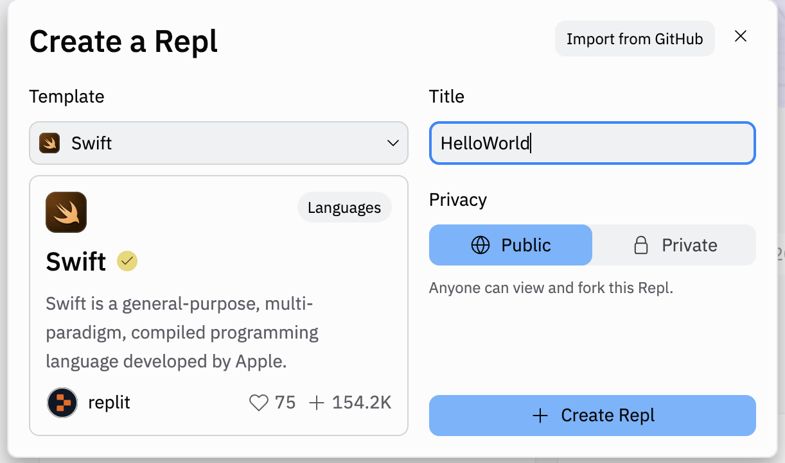

# QND Computer Science Day 1 
Mark Schmidt

---

# Agenda

- Learning philosophy
- Programming Languages
- Python
- Replit
- Your first (actual) program

---

# Learning Philosophy

- You will not master everything today
- You will (probably) be lost
- That's okay!
- Practice, practice, practice

---

# Machine Code 

- Hard to write and understand
- Different computer types use different machine code


---

# Programming Languages

- *Compile* to machine code
- Tradeoffs
    - Ease of use
    - Readability
    - Speed
    - Memory management

---

# Swift

- Programming Language created by Apple
- Used for creating iOS and macOS applications
- Simple and modern!


--- 

# Replit

- We need a coding environment
- **Replit** is an online Integrated Development Environment
- Skip installation/package management/local device issues 

---

# Setup

1. Create an account (use your Google account)
2.  Press "+" in the top right
3.  Select **Swift** as a template
4.  Title **Hello World**
5.  Press "Create REPL"



---

# Hello World!

In **main.swift**, we already have:

```swift
print("hello from Swift!")
```

Then tap the **▶️ Run** button on top

You should see `hello from Swift!` in the console below

---

# Repitition and Variables

```swift
print("hello from Swift!")
print("hello from Swift!")
print("hello from Swift!")
```

--- 
# Variables

- *Declare* variables with `let`
- Just like in math, replaces the variable with a value
- Read it as "Let greeting equal ..."

```swift
let greeting = "hello from Swift!"
print(greeting)
print(greeting)
print(greeting)
```

---
# Concatenation

- Combine variables together!

```swift
let greeting = "Hello "
let name = "Mr. Schmidt"
print(greeting + name)
```
---

# This program is boring!

- It needs to respond to user input
- Use the `readLine` function!
- Waits for the user to type in the console and press Enter
- Stores the value in a variable

```swift
print("What is your name?")
let name = readLine()!
...
```
- Use concatenation to greet the user!

---

# One More Thing

- Comments + Spacing
- Empty lines can be ignored
- Anything after a `//` is ignored by the program

```swift
// Ask the user for their name
print("What is your name?")
let name = readLine()!

// Note the space after Hello
let greeting = "Hello "
print(greeting + name)
```


---

# Extra Challenges

- Print the greeting 3 times
- Ask a user for their name and their favorite color. Print each out 3 times.
- Print empty lines between each line of output
  - What happens if we pass `""` to `print`?