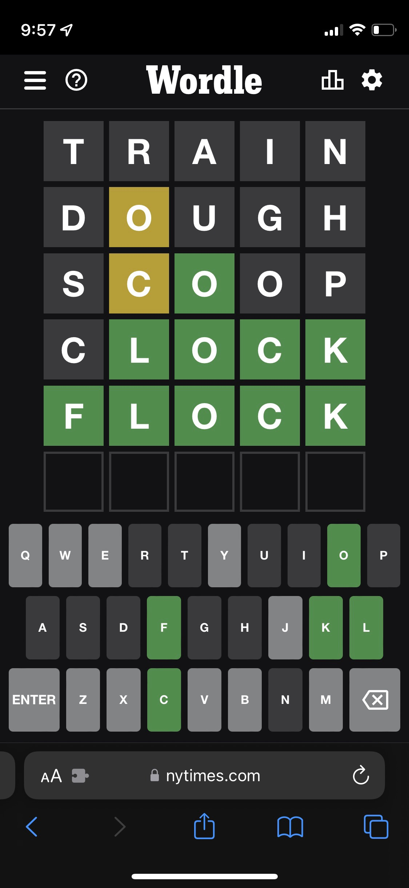

# QND Computer Science Day 10
Mr. Schmidt

--- 

# Recap

- Guess My Number

---

# What's Next?

Wordle
- Very fun game
- Very simple



<!-- -->
<!-- Explain the rules of wordle -->
<!-- Multi-day process -->

---

# What does this output?
```swift
let ice_cream_flavors = ["Chocolate", "Vanilla", "Cookies and Cream", "Strawberry"]

for flavor in ice_cream_flavors {
    console.write("The flavor is \(flavor)")
}
```

<!-- -->
<!-- Should iterate through the Array and console.write each option -->
<!-- Discuss Array syntax (brackets, commas) -->
<!-- Discuss empty Array -->
---

# What does this output?

```swift
let ice_cream_flavors = ["Vanilla", "Chocolate", "Cookies and Cream", "Strawberry"]

let my_favorite = ice_cream_flavors[2]
console.write("My favorite flavor is \(my_favorite)")

```

<!-- -->
<!-- Get a show of hands for each option -->
--- 

# Why do Arrays start at zero?

- It's a single block of memory
  - The first element is at the first address
- It's what lots of other languages do

---
# What happens when we change 2 to 4?

```swift
let ice_cream_flavors = ["Vanilla", "Chocolate", "Cookies and Cream", "Strawberry"]
                          // 0          1             2                   3 

let my_favorite = ice_cream_flavors[2]
console.write("My favorite flavor is \(my_favorite)")


```

<!-- -->
<!-- Show indices past the end of the Array lead to an error -->

--- 

# Array Contains

- How to check if a Array contains an item?

```swift
if favorite_ice_cream_flavors.contains("Chocolate") {
    console.write("Yum!")
}
```

---


# Wordle

- Multiple stages, like Guess My Number


---

# Stage 1: Grade a Guess

- Turn a string into an Array
- Get a guess from the user

---

# Stage 2: Looping and Validation

- Put the guess part in a loop
- Check if the guess is the right length
  - Use `continue`
- Check if the guess is correct!
---


# Stage 3: Guess Count Limit
- Track the number of guesses
- If guesses >= 6, tell the user they lost
- Random word from a word bank!

---

# Stage 4: Miscellania

- Use ColoredString instead of emoji
- Always compare in the same letter casing

---

# Stage 5: Play again?

- Wrap it all in a loop
- When the inner loop exits, ask if they want to play again. Otherwise, break