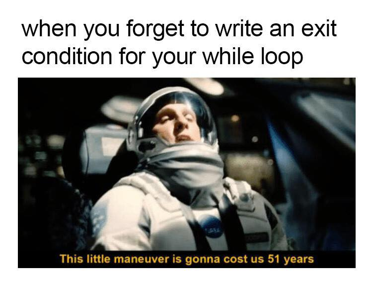

# QND Computer Science Day 10
Mark Schmidt

--- 

# Agenda

- Recap
- Loops
- `var` variables
- Booleans (you've been using them already)
- Making a game!

---

# Recap

- Calculator


---

# `var`

```swift
var count = 0
```
- Read as "set variable count to 0"
```swift
count = count + 1
```
- Read as "set count to count + 1"

- `let` cannot be changed
- `var` can
---

# Loops

- `while` loops
- `for loops`


<!-- -->

---

# Repeating code

```swift
var count = 1
while count < 5 {
    print("Hello, World! Count = \(count)")
    count = count + 1
}

```


---

# Here be dragons!

```swift
var count = 1
while count > 0 {
    print("Hello, World! Count = \(count)")
    count = count + 1
}

```
---

# Infinite Loops

- "Why isn't my program running?"
- This program will never end
- To exit early, use STOP button
- Beware of overflowing resources!


---
# Loops!

```swift
var running = true
while running {
    print("Enter a number")
    let firstNumber = Int(readLine()!)!

    print("Enter another number") 
    let secondNumber = Int(readLine()!)!

    print("Enter a command")
    if command == "q" || command == "quit" {
        running = false
    } else if command == "add" {
        ...
    }
}
```

---

# Today's Task

- Guess My Number Game


