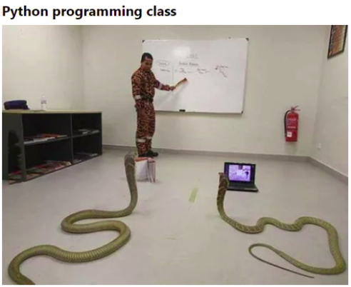

# QND Computer Science Day 11
Mark Schmidt

--- 

# Time to get Classy

- What's this do?
```python
tacos = Order("Tacos", 4.50, ["Cheese", "Lime", "Carnitas"], "Diet Coke")
burrito = Order("Burrito", 5.00, ["Beef", "Sour Cream", "Rice"], "Oreo Milkshake")

print(tacos.price)
```

<!-- -->
<!-- What will this print? -->
<!-- Any guesses on how to print "5.00"? -->
---


# Classes and Objects 

- Organize data
- Encapsulate logic
- Define a class, use it to create objects



---

# An Example

```python
class Order:
    def __init__(self, name, price, ingredients, drink):
        self.name = name
        self.price = price
        self.ingredients = ingredients
        self.drink = drink
    
    def dairy_free(self):
        return "Milk" not in self.ingredients and "Cheese" not in self.ingredients
    
```

<!-- -->
<!-- Draw attention to the special init function -->
<!-- self parameter -->
<!-- Is there a problem with our dairy free function? -->
<!-- It does not check the drink! -->
---
# An Example (continued)

```python
class Cart:
    def __init__(self, delivery_address):
        self.orders = []
        self.delivery_address = delivery_address

    def total_price(self):
        total = 0
        for order in self.orders:
            total += order.price
        return total 
    
    def add_order(self, order):
        self.orders.append(order)
```

<!-- -->
<!-- Classes compartmentalize logic -->
<!-- It's a lot easier to think about a Doordash app if we have a Cart object and an Order object -->

---

# All Together

```python
cart = Cart("1233 Main St.")
while True:
    order = get_order()
    if order == None:
        break
    cart.add_order(order)

print(f"The total price of your cart is ${cart.total_price()}")
```
---

<!-- This is OBJECT ORIENTED PROGRAMMING -->

# What will this do?

```python
print(f"Your cart is {cart}")
```
---

<!-- -->
<!-- Bad news: it just prints a memory address-->
<!-- Use __repr__ to fix this -->

# Project

- Update Reminders to be class driven
- Bonus
    - Delete reminders
