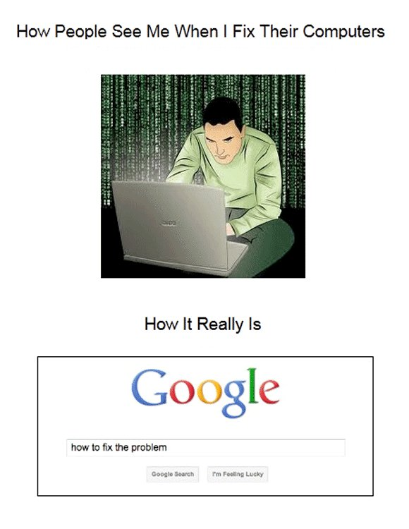

# QND Computer Science Day 11
Mark Schmidt

--- 

# Today

- Recap
- Guess My Number improvements
  - Guess Count
  - Error handling
  - Random number generation
  - Colors! 
    - If we have time


---

# Recap

- While Loops
- `var`
- Booleans

---

# Guess Count

- Create a new variable `guessCount`
- Increment it each time the user guesses
- Print the number of guesses at the end

--- 


# Random Numbers

- You don't need to memorize everything!
- Let's Google it



---

# Random Number Generation

```swift
let number = Int.random(in: 1..<100)
print(number)
```

- How would I change the range to be between -100 and 1000?
---

# New Things

- `.` is read as "dot"
  - Access functions, variables of a type or variable
  - `Int.random` gets the `random` function from the `Int` type
- `..< ` creates an exclusive (open) range
- `...` creates an inclusive (closed) range

---

# `if let`

- We use `!` to quit the program if `Int()` cannot do a conversion
- `if let` allow us to handle the error without crashing

```swift
print("Enter a number")
if let number = Int(readLine()!) {
  // Do something with the number!
}
// Number does not exist outside this context
```

---

# Colors

- Swift does not have built in color output
- Move your code into a new replit project based off of [this template](https://replit.com/@mrschmidt/Swift-Colors-Template#colors.swift)
- Adds an extension to Strings that gets a colored version
  - red, yellow, green, blue, magenta, cyan

```swift
print("Hello, World!".red())
```


