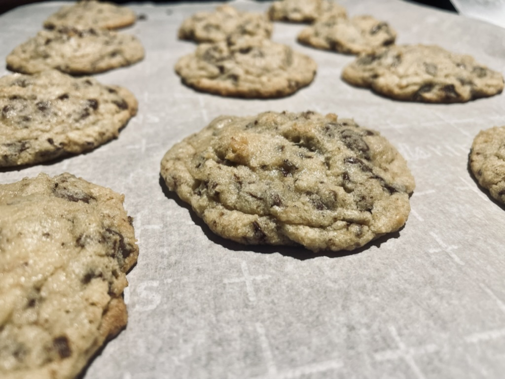

# QND Computer Science Day 12
Mark Schmidt

--- 

# Final Project

- Messages ➡️ Personal Assistant


---

# Personal Assistant

- Messages
- At least one of:
    - Weather
    - Sports
    - Stocks
    - Crypto
    - Spotify Top Songs
    - Wordle
- Another of the above, or something else pending approval

---

# Let's Make a Deal

- You have all next week to work on this
- This class is work time
- You have plenty of things to do
    - If you finish the main 3 items, add more to your personal assistant!
    - Impress me!


---

# Carrot

- If everyone is on task, I will make cookies



---

# Stick

- More lectures and daily projects
    - Classes
    - Error handling
    - Files
    - Advanced loops
- Final exam
---
# Weather

- Use OpenWeatherMap API
- You'll need to get an API key (easy)
- Extra Credit:
    - Display different emoji for different weather conditions

---
# Sports

- Use my public API
- `https://livescoresapi.mrschmidt.repl.co/sport/golf`
- Supported sports:
    - `golf`, `baseball`, `hockey`, `college-football`, `football`, `college-basketball`, `basketball`, `all`
- Use `teams/{sport}` endpoint to fetch team details


---

# Stocks

- Use `yfinance` python package to fetch stock data
- Just a few lines of code!
```python
import yfinance as yf

google = yf.Ticker("GOOG")  # Fetches data
info = google.info  # Dictionary with many options
price = info["currentPrice"]  # Get the current price
print(f"One share of Google is worth ${price}")
```

---

# Crypto

- Use `yfinance`
    - A little bit different path than stocks


<!-- -->
<!-- Important to note that crypto is a scam-->

---
# Spotify Top Songs 

- Use Spotipy
- Rather involved but VERY cool

--- 

# Wordle

- You already did Wordle!
- Just copy it over!

---

# Ascii Art

- Fetch ascii art from https://ascii-art.mrschmidt.repl.co/random


# Requirements & Details

