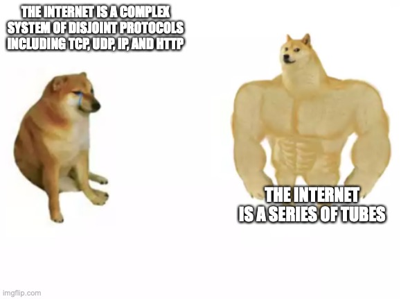

# QND Computer Science Day 12
Mark Schmidt

--- 

# The Internet

- How does it work?



<!-- The internet is a series of tubes! -->
<!-- There are various complex handshakes and protocols, out of scope for our classj-->

---

# API

- Application Programming Interface
- How does your program talk to the outside world?

---

# An Example

```python
import requests

def get_weather(city, api_key):
    url = "http://api.openweathermap.org/data/2.5/weather"
    params = {"q": city, "appid": api_key}
    response = requests.get(url, params=params)
    return response.json()

```

<!-- What will this do? -->
<!-- Why do I need to import requests? -->

---

# Project

- Update Reminders to use my API
- 