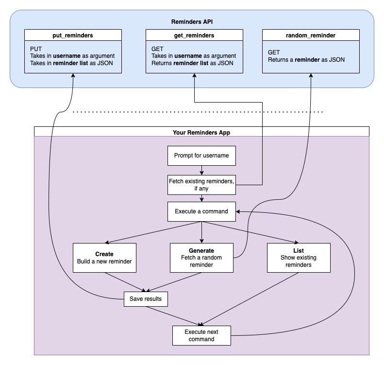

# QND Computer Science Day 13
Mark Schmidt

--- 




<!-- -->
<!-- Explain how different method types work -->
---

# Security

- Is this API safe?

<!-- -->
<!-- No protection from someone else overwriting your reminders -->
<!-- Anyone can read your reminders -->

---

# POST example

```python

def send_message(url, message, username):
    data = {"message": message}
    response = requests.post(url, json=data, params={"username": username})
    return response.json()

```

<!-- -->
<!-- requests post method is very similar to get -->
<!-- takes in response -->


---

# Project

- Update Reminders to fetch/store reminders from API
- Bonus:
    - Password authentication