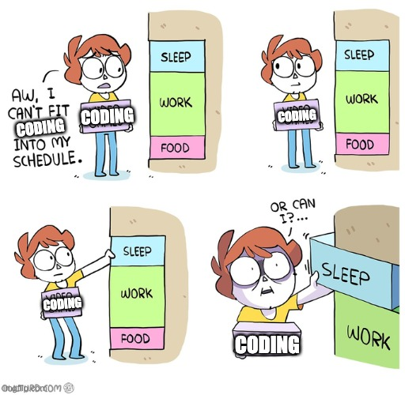
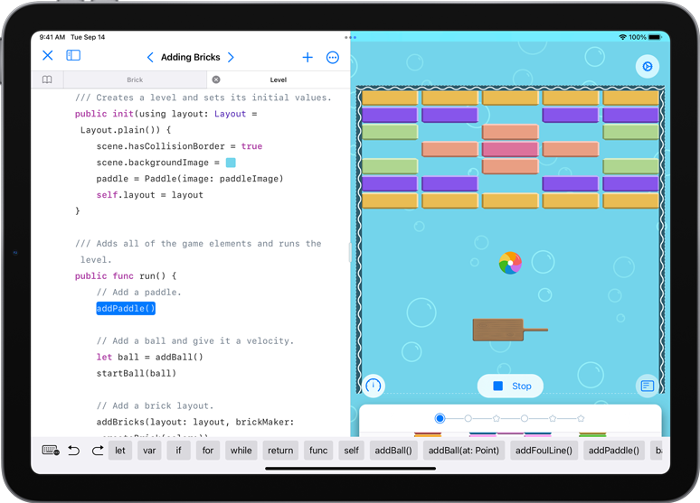
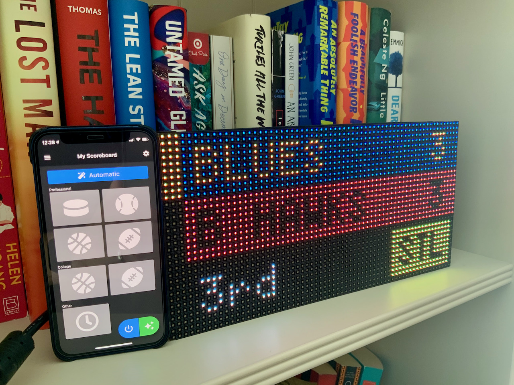
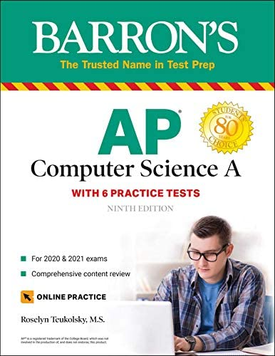
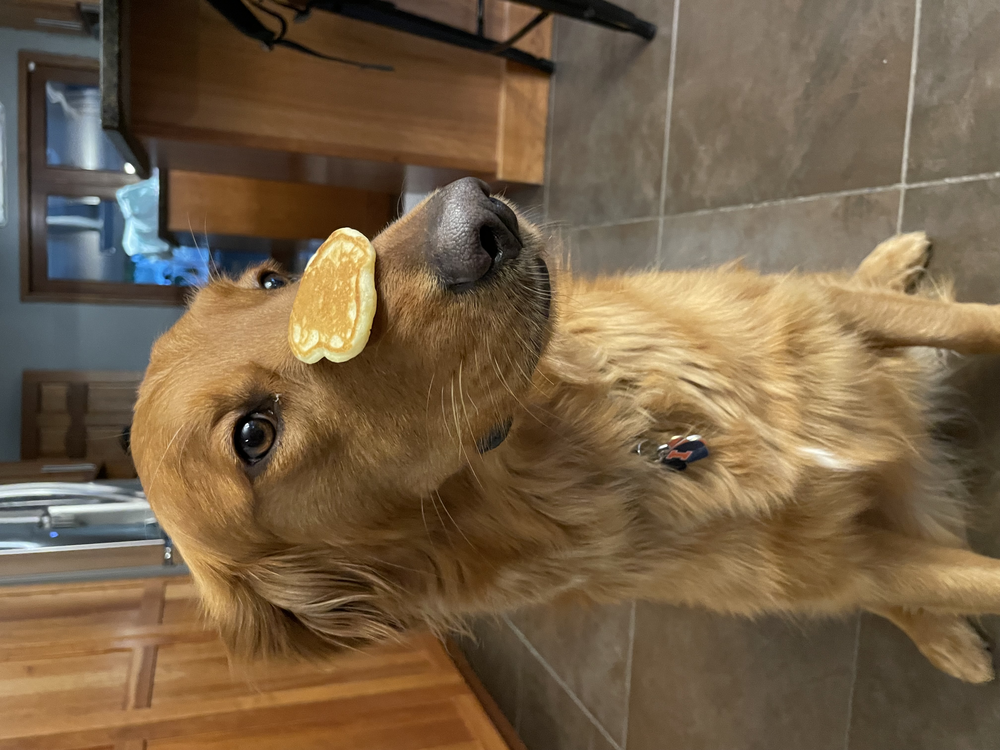

# QND Computer Science Day 14
Mark Schmidt

--- 

# The Last Day

- Cookies!
- Recap
- What's Next?
- Survey

---

# What Did We Learn?

- Variables
- Strings
- Integers and Booleans
- `if`/`elif`/`else`
- `while` and `for` loops
- Functions
- Lists + Dictionaries
- The Internet

---

# What's Next?

- If you didn't like this...
    - You're done!
- If you did like this...
    - There's a **lot** more to learn!

---

# How to Learn

1.  Copy directly from books and resources
2.  Replicate and remix
3.  Make something totally new!

---

# Intrinsic vs. Extrinsinc Motivation

- Extrinsinc motivation 
    - Threatening with a final exam
    - Rewarding with cookies
- Intrinsic motivation
    - An innate desire to learn 
    - Wanting to create something  

---

# Schedule

- High School is hard!

---

# Some Recommendations

- Apps
- Web
- Games
- Hardware

---

# Apps

- iOS
    - Swift
    - Swift Playgrounds
- Android
    - Java/Kotlin
- Flutter
    - Dart

---

# Web

- HTML/CSS/JS
- TypeScript
- React
- Do it all in Replit!

---

# Games

- pygame
    - Python
    - Available in Replit!
- Unity
    - C#

---

# Hardware

- Raspberry Pi
    - Python
- Arduino
    - C

--- 

# Resources

- SO MANY RESOURCES
- Books!
- YouTube
- Replit
- Swift Playgrounds

---

# Education

- Take the AP Comp Sci test
- Counts for college credit + provides motivation

---

# Final Advice

- Practice, practice, practice
- Don't be afraid to ask for help
- Ship it!

---

# Me

- If you want to contact me, ask Mrs. Steinkamp
- I may be around next semester...

--- 

# Thank You! 

- I hope you enjoyed this class!
- markschmidt.io/qnd-feedback
- markschmidt.io/qnd-follow-up

