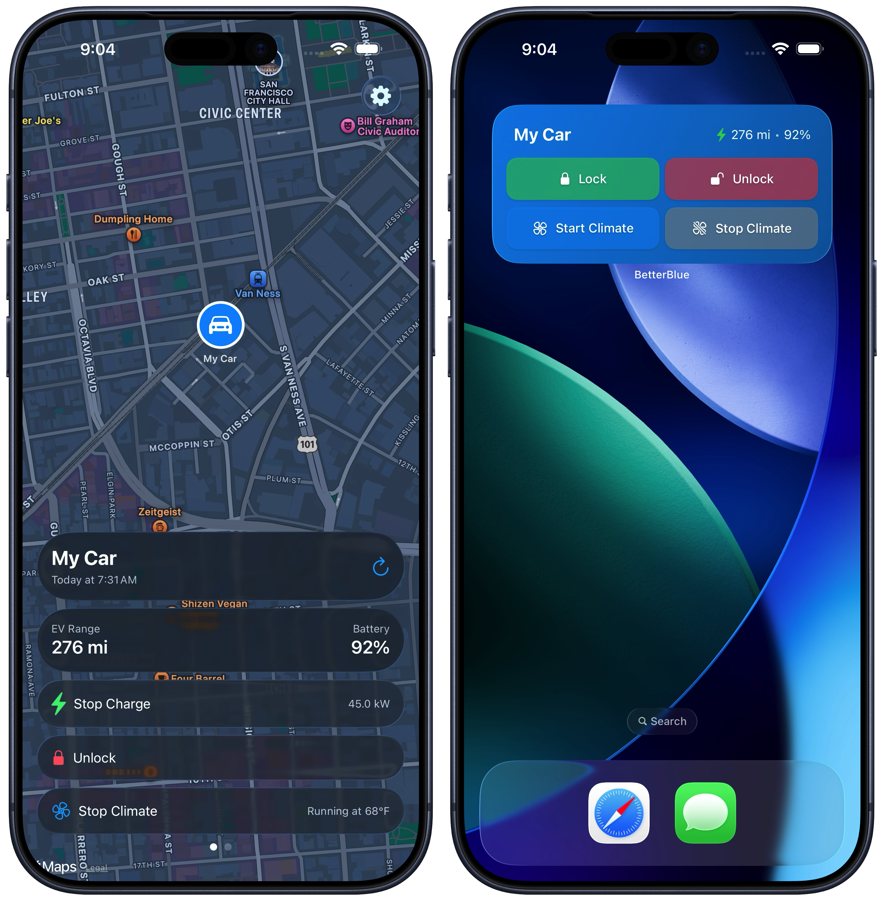

# QND Computer Science Day 15
Mr. Schmidt

--- 

# Today

- Submit your turtle project!
- iOS App Development

---

# iOS Apps

- App Store released in 2008
- I have several apps!
- Use SwiftUI



---

# It's all Views!

```swift
struct ContentView: View {
  var body: some View {
      Text("Hello world!")
  }
}
```
- Lots of curly braces and nesting
---

# Managing State

```swift
struct ContentView: View {
  @State var count = 0
  var body: some View {
    VStack {
      Text("Count is \(count)")
      Button("Press") {
        count += 1
      }
    }
  }
}
```

---

# Chatroom

- I have set up a chatroom
- Write an app to send messages that you can see on the screen
- Keep it appropriate, I am tracking your IPs
- Grab code from my website for the client

---

# Sending a Message

```swift
struct ContentView: View {
  var body: some View {
    Button("Send") {
      Task {
        try await sendMessage(username: "YOUR NAME HERE", message: "Hello World!")
      }
    }
  }
}
```

- Task for running background code
- `try await` to handle errors and wait for network

---

# TextField

```swift
struct ContentView: View{
  @State var text = ""
  var body: some View {
    HStack {
      TextField("Message", text: $text)
      Button("Send") {
        Task {
          try await sendMessage(username: "YOUR NAME HERE", message: "Hello World!")
        }
      }
    }
  }
}
```

---

# TextField

- `$` creates a Binding -- lets some other View change a part of your View