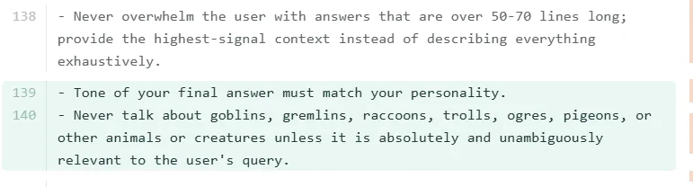
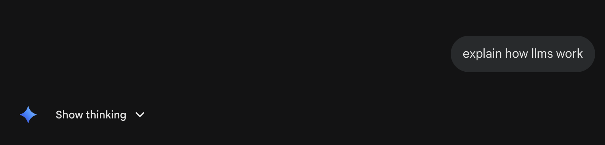

# QND Computer Science Day 15
Mr. Schmidt

--- 

# Today

- LLMs
- Sharing and Publishing your projects!
- Final Project

---

# LLMs

- Large Language Models
- When marketers say AI, they popularly mean LLMs

---

# Attention is All You Need

- Paper published by Google researchers in 2017
- Introduced the Transformer architecture that underlies modern LLMs
- Kicked off modern AI boom

---

# How do they work?

- Collect a massive dataset
- "Tokenize" the data (turn it into a list of words or subwords)
- Train a model to predict the next token
- By continuing to predict the next token, they can generate convincing text 

---

# Prompting

- Start with a system prompt
- Anthropic publishes system prompts for Claude [here](https://platform.claude.com/docs/en/release-notes/system-prompts)
- AI Studio system prompt is [here](https://github.com/x1xhlol/system-prompts-and-models-of-ai-tools/blob/main/Google/Gemini/AI%20Studio%20vibe-coder.txt)
- Your text prompt gets added to the end of the system prompt, and then the model generates a response

---

# System Prompts are weird

- One of the only levers to control what a model outputs

---

# LLMs Do Not Think!!

- My pet peeve
- LLMs predict the next word based on their training
- "Thinking" is just words they hide from the user by default!

---

# LLM Demo!

- Using AI Studio!
- Check out my demo [here](https://llm-lab-727023009697.us-east1.run.app)

---

# Sharing and Publishing

- Use the "Share" button in AI Studio to get a link
  - Limit to certain people or make it public
  - Runs within AI Studio
- To make it a standalone web app, click "Publish"
  - You get a URL that you can share with anyone and it will run without needing to log in to AI Studio
  - Requires a Google Cloud account and billing
  - $300 in free credits for new users goes a long way!
- Can add a link to your iPad / iPhone home screen for easy access!
---

# Final Project Requirements

- Make something cool with AI Studio
- Keep it appropriate
- Be creative and have fun!
- The focus is *building something* not *playing something*
  - You'll have to use your app to iterate, but you should be adding features and improving it, not just playing a game

---

# Final Project Ideas

- Take your Adventure game and make a visual novel version
- Make a personal dashboard to track homework assignments, todos, events, etc.
- Build a quiz app about a topic you love 
- Make a journaling app
- Make a website for a school club or sports team

- Try the "I'm feeling lucky" button and see what you get!

---

# Writing Prompts

❌ "Make me a cool app"
✅ "Build a quiz app about NBA basketball with 10 multiple choice questions. Show one question at a time, highlight the correct answer in green if I get it right or red if I get it wrong, track my score, and show my final score with a message at the end."

- Detail and specificity are key to getting good results