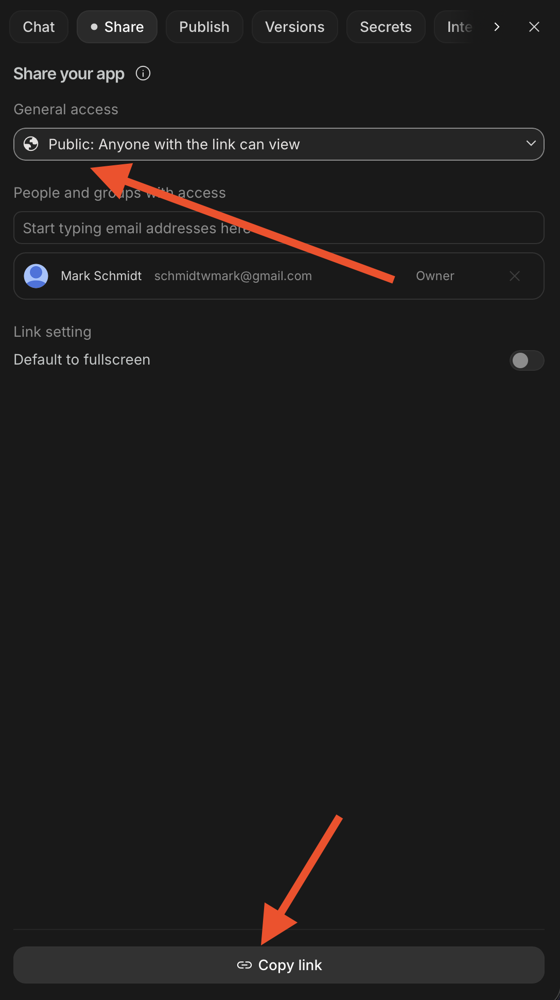

# QND Computer Science Day 16
Mr. Schmidt

--- 

# Today

- Last Day of Coding

---

# Expectations

- Let's make good use of time today
- Polish your project, or use what you've learned to make something new!
- Submit your code at the end of class

---

# Tomorrow

- We'll do a show and tell of everyone's projects
- Present *either* your turtle project or your AI Studio project
- Informal -- I will show your project and maybe ask some questions
- Make sure your project is something you're proud to share!

---

# Project Submission

- Use the Share button
- Make sure to make it publicly viewable!

