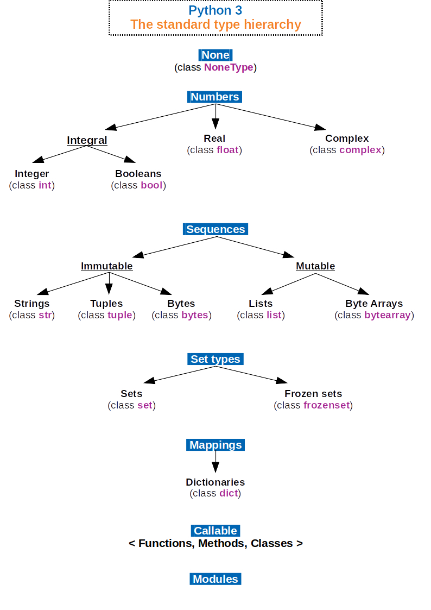

# QND Computer Science Day 2
Mark Schmidt

---

# What does this do?

```
a = 5
b = 4

sum = a + b

print(sum)
```
---
# Types

- What is a **type**?
    - A kind of data
    - **Types** have associated methods and operators
    - You can print or concatenate strings
    - You can do math on numbers

    

---

# What does this do?

```
number = input("Enter a number to be multiplied by 5 ")

product = 5 * number

print(product)
```
---

# Basic Math

Let's add some new types

- **int**
    - An integer
    - 0, 5, 71, -115, ...
- **float**
    - A decimal number
    - 5.2, 8.333, 9.6
    - Limited precision (it's weird)


---

# Type Conversions

`int()`
`str()`
`float()`

---

# Project Time

Make a **calculator**

Use `input()` twice to get two numbers

Compute the sum, print it out!

--- 

# Bonus Challenges

1. Also print the difference (-)
2. Also print the product (*)
3. Also print the quotient (/)
4. Ask for three numbers!


