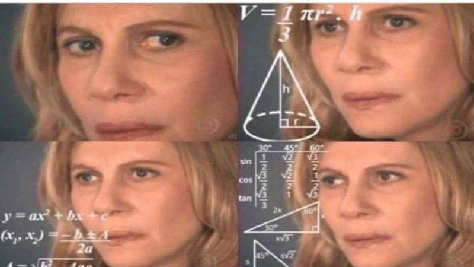

# QND Computer Science Day 2
Mark Schmidt

---

# What does this do?

```python
a = 5
b = 4

sum = a + b

print(sum)
```

<!-- -->
<!-- Should print the number 9 -->
---

# What does this do?

```python
number = input("Enter a number to be subtracted from 5 ")

difference = 5 - number

print("The difference is " + difference)
```
<!-- -->
<!-- Note that anything after a # is a comment. Useful for >
<!-- Gotcha 1: fails to subtract because number is a string>
<!-- Gotcha 2: fails to run until we add str() -->
<!-- Brief aside on types -->
---

# Basic Math

- **int**
    - An integer
    - 0, 5, 71, -115, ...
- **float**
    - A decimal number. The decimal point "floats"
    - 5.2, 8.333, 9.6
    - Limited precision (it's weird)


<!-- -->
<!-- Show 0.1 + 0.1 = 0.2, 0.1 + 0.2 => 0.3000000004 -->

---

# Project Time

Make a **calculator**

Use `input()` twice to get two numbers

Compute the sum, print it out!

--- 

# Bonus Challenges

1. Also print the difference (-)
2. Also print the product (*)
3. Also print the quotient (/)
4. Ask for three numbers!


