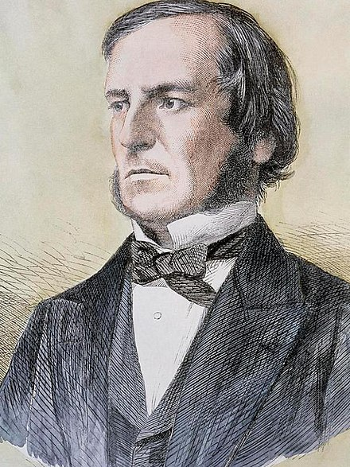

# QND Computer Science Day 3
Mark Schmidt

--- 

# Booleans

- George Boole
    - In 1854 wrote *The Laws of Thought*
    - New algebra
- Booleans can either be `True` or `False`

```
a = True
b = False
```



--- 

# Conditions

`>`, `<`, `<=`, `>=`, `==`

```
age = input("How old are you? ")
greater = age > 16

print("Age is greater than 16: " + str(greater))
```

---

# if else

What do you think this will print out?

```
age = 14

if age >= 16:
    print("You are old enough to drive a car")
else:
    print(f"You'll be old enough in {16-age} years")
```

---

# elif

Multiple conditions!

Evaluated *in order*, picking the first one where the condition is `True`

Many elifs

```
age = 17
if age > 18:
    print("You are old enough to vote and drive")
elif age > 16:
    print(f"You are old enough to drive and can vote in {18 - age} years")
else: 
    print(f"You can drive in {16 - age} years")
```

---

# Error Handling

What happens if I enter 0 for b?

```
a = int(input("First number "))
b = int(input("Second number "))

quot = a / b

print("Quotient is " + str(quot))
```

---

# Error Handling

```
Traceback (most recent call last):
  File "main.py", line 7, in <module>
    quot = a / b
ZeroDivisionError: division by zero
```

---

# Sanitizing Input

```
if b == 0:
    print("Cannot divide by zero")
else:
    ...
```

---

# and 

a | b | a and b
-----|------|:-----:
True | True | True
True | False | False
False | True | False 
False | False | Falase 

---
# or 

a | b | a or b
-----|------|:-----:
True | True | True
True | False | True 
False | True | True 
False | False | Falase 

---


# Project 

Extend our calculator from yesterday

Ask the user to choose an operation
Add, subtract, multiply, divide

Use `if, elif, else` to perform that operation

---

# Bonus
- Add exponenentiation (**)
- Add remainder (%)
- Add integer division (//)