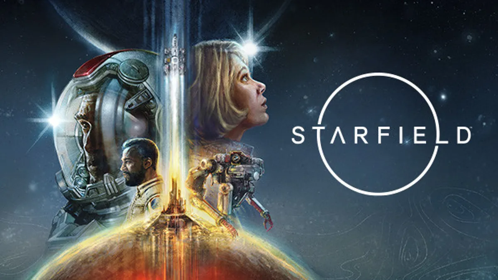
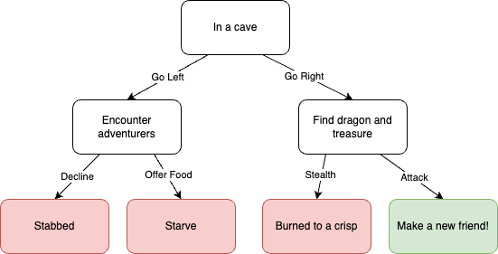

# QND Computer Science Day 4
Mr. Schmidt

--- 

# Recap

- `if`
- `else if`
- `else`

---

# Today

- Nested Ifs
- Video Games
- Making a video game


---

# Nested Ifs

- You can put if statements inside of other if statements

```swift
...
if guess == "Hot To Go" {
    console.write("That's right! Chappel Roan's Hot To Go is the song of the summer.")
    console.write("What's the best movie of the year?")
    let movie = readLine()!
    if movie == "Dune: Part Two" {
        console.write("Giant Sand Worms >>>> Anything else")
    } else if movie == "Deadpool and Wolverine" {
        console.write("Cameo cringefest 👎👎👎")
    } else {
        console.write("Wrong answer, try again!")
    }
} else if guess == "Espresso" || guess == "Please Please Please" {
...
```

<!-- Show nested -->
---


# Video Games

- What games are you currently playing?

---

# Video Games 

- What is the oldest game you've ever played?

---

# Zork 

- Text based games
- Before computer graphics
- https://classicreload.com/zork-i.html


---

# Narrative Fiction

- Still developed today!
- Hugely influential




---

# My Example

- https://replit.com/@mrschmidt/Adventure#main.swift
- Escaping quotes with `\"`
- Nested Ifs
- Empty console.write statements

---

# Flowchart



---

# Make Your Own

- Give the user some story and a simple choice
- Use nested `if` statements to console.write what happens next
- You can have more than 2 options at each choice!
- 3 choices total
- Be creative!
- *Keep it appropriate*
