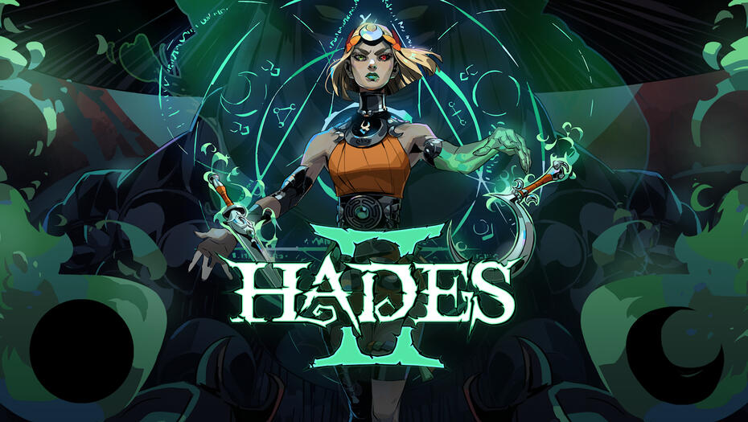
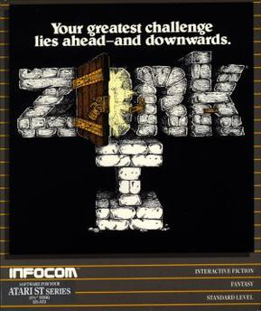

# QND Computer Science Day 4
Mr. Schmidt

--- 

# Recap

- `if`
- `else if`
- `else`

---

# Today

- OR
- Nested Ifs
- Video Games
- Making a video game


---

# OR


- `==` is case sensitive and spelling sensitive
- How can we make sure that both `"manchild"` and `"Manchild"` are allowed?

```swift
if guess == "Manchild" || guess == "manchild" {
    ...
}
```
- `||` is the OR operator
- Note: `guess == "Manchild" || "manchild"` is not correct -- the `||` must go between two full comparisons

---

# Nested Ifs

- You can put if statements inside of other if statements

```swift
if guess == "Manchild" {
    console.write("That's right!")
    console.write("") // Empty line to separate output

    let song = console.read("What the best song on her new album?")
    if song == "Nobody's Son" {
        console.write("Correct!")
    } else {
        console.write("Wrong!")
    }
} else if guess == "Golden" {
// ...
```

<!-- Show nested -->
---


# Video Games

- What games are you currently playing?



---

# Video Games 

- What is the oldest game you've ever played?

---

# Zork 

- Text based games
- Before computer graphics
- https://classicreload.com/zork-i.html



---

# My Example

- Escaping quotes with `\"`
- Nested Ifs
- `console.write("")` for empty space

---

# Flowchart


---

# Requirements

- Give the user some story and a simple choice
- Use nested `if` statements to `console.write` what happens next
- You can have more than 2 options at each choice!
- 3 choices total, minimum
- Be creative!
- *Keep it appropriate*
