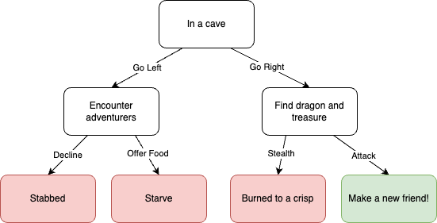

# QND Computer Science Day 4
Mr. Schmidt

--- 

# Recap

- Adventure game
- Nested Ifs

---

# My Example

- Escaping quotes with `\"`
- Nested Ifs
- `console.write("")` for empty space
- Comments

---

# Flowchart

---

# Requirements

- Give the user some story and a simple choice
- Use nested `if` statements to `console.write` what happens next
- You can have more than 2 options at each choice!
- 3 choices total, minimum
- Be creative!
- *Keep it appropriate*
