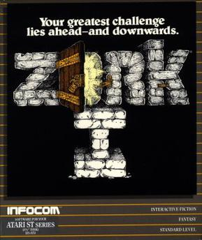

# QND Computer Science Day 4
Mark Schmidt

--- 

# Recap

- `if`
- `else if`
- `else`

---

# Today

- Nested Ifs
- Video Games
- Making a video game

---


# Nested Ifs

- You can put if statements inside of other if statements

```swift
...
if answer == "Cookies and cream" {
    print("Correct, oreos in ice cream is the best")
    print("Waffle cones or sugar cones?")
    let cones = readLine()!
    if cones == "Waffle cones" {
        print("Come on, who doesn't love a fresh waffle cone?") 
    } else {
        print("WRONG")
    }
}
...
```

<!-- Show nested -->
---

# Video Games

- What games are you currently playing?

---

# Video Games 

- What is the oldest game you've ever played?

---

# Zork 

- Text based games
- Before computer graphics
- https://classicreload.com/zork-i.html



---

# Narrative Fiction

- Still developed today!
- Hugely influential


---

# My Example

- https://replit.com/@mrschmidt/Adventure#main.swift
- Escaping quotes with `\"`
- Nested Ifs
- Empty print statements

---

# Flowchart


---

# Make Your Own

- Give the user some story and a simple choice
- Use nested `if` statements to print what happens next
- You can have more than 2 options at each choice!
- 3 choices total
- Be creative!
- *Keep it appropriate*
