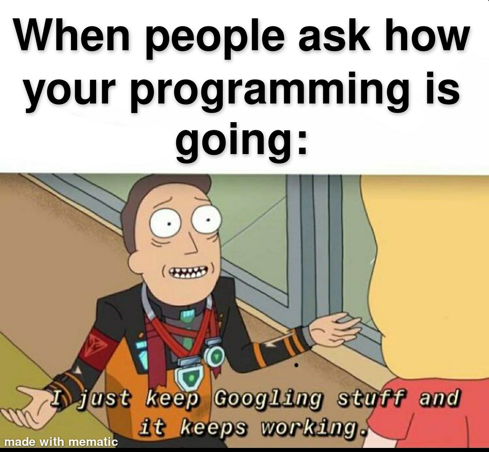

# QND Computer Science Day 5
Mark Schmidt

--- 

# What does this output?
```
ice_cream_flavors = ["Chocolate", "Vanilla", "Cookies and Cream", "Strawberry"]

for flavor in ice_cream_flavors:
    print("The flavor is " + flavor)

```

<!-- Should iterate through the list and print each option -->
<!-- Discuss list syntax (brackets, commas) -->
<!-- Discuss empty list -->
---

# What does this output?

```
ice_cream_flavors = ["Vanilla", "Chocolate", "Cookies and Cream", "Strawberry"]

my_favorite = ice_cream_flavors[2]
print(f"My favorite ice cream is {my_favorite}")

```

<!-- Get a show of hands for each option -->
--- 

# Deep Dive: Why do Lists start at zero?

- First, we have to talk about memory

---

# Memory

- Where does your program store all of its data?


# A simple program

```
team_name = "Chicago Blackhawks"
team_id = 42

stanley_cup_wins = [1934, 1938, 1961, 2010, 2013, 2015]

```

--- 

# TODO diagram 

---

# Back to code

```
ice_cream_flavors = ["Vanilla", "Chocolate", "Cookies and Cream", "Strawberry"]

my_favorite = ice_cream_flavors[4]
print(f"My favorite ice cream is {my_favorite}")


```

<!-- Show indices past the end of the list lead to an error -->
<!-- Show negative indices -->

--- 
# How can we add elements to a list?

- Any guesses?

<!-- Maybe we can concatenate? -->
<!-- Try it in a repl -->

--- 
# Let's Google it!

- software engineering is:
    - 10% knowing what to do
    - 90% knowing what to Google
- shh don't tell anyone



---

# Project

- For each calculation, append the result to a list
- Update your calculator with a history command
- When the user enters History, print out the entire history contents