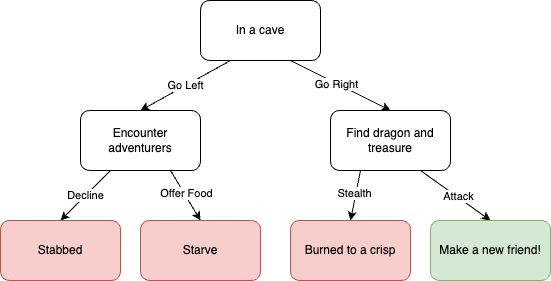

# QND Computer Science Day 5
Mr. Schmidt

--- 

# Today

- Recap
  - Nested ifs
- Adventure Game Project

---

# Adventure Game

- Plan out your story on paper!
- Refer to my example (but don't copy!)

---

# Requirements

- Give the user some story and a simple choice
- Use nested `if` statements to `console.write` what happens next
- You can have more than 2 options at each choice!
- 3 choices total, minimum
- Be creative!
- *Keep it appropriate*

---

# Flowchart

