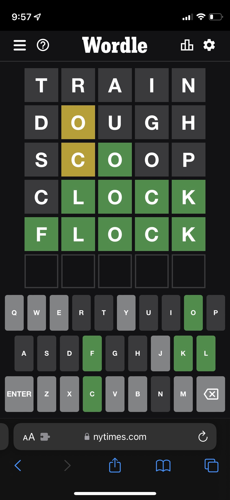
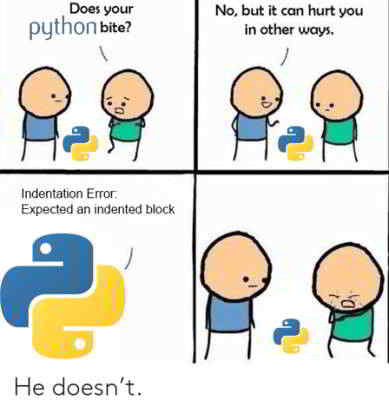

# QND Computer Science Day 6
Mark Schmidt

--- 

# Recap 

- Strings, Input, and Output
- Math
- If, else, booleans
- Loops
- Lists

--- 

# What's Next?

Wordle



<!-- -->
<!-- Explain the rules of wordle -->

---

# What does this output?

```python
def build_greeting(name):
    return f"Hello, {name}"

print(build_greeting("Mr. Schmidt"))
print(build_greeting("World!"))
```




<!-- -->
<!-- Two greets. Draw attention to arguments, def keyword, indention, return keyword -->

<!-- Show moving `print` into function-->

<!-- This is a contrived example -->

---

# Functions

- Key for reuse and organization
- Reduce copy + pasted code
- Optionally accepts *arguments* 
- Optionally returns a value

<!-- -->
<!-- Print is a function that does not return a value! -->
<!-- Input is a function that does not require arguments -->

---

# Mutability

```python
ice_cream_flavors = ["Chocolate", "Vanilla"]
flavors_reference = ice_cream_flavors # assign a new name to the same object
flavors_reference.append("Cookie Dough")
print(f"Ice cream flavors: {ice_cream_flavors}, flavors_reference: {flavors_reference}")

# Set flavors_reference to a new object
# Leave old object intact
flavors_reference = ["Strawberry"]
print(f"Ice cream flavors: {ice_cream_flavors}, flavors_reference: {flavors_reference}")
```
---

<!-- -->
<!-- Using '=' creates a new assignment -->
<!-- Drawing a little diagram here on the whiteboard would be helpful -->

# What does this do?

```python
def add_5(value):
    value = value + 5
    print(f"Value is {value}")

def add_name_to_list(my_list):
    my_list.append("Ada Lovelace")
    print(f"My list is {my_list}")
```
<!-- -->
<!-- add_5 replaces the value are *replacing* value, but that does not affect my_value -->

---

# Project

- Write a `verify_word(guess_word, secret_word)` function that returns a string of 🅱️moji 😂😂😂😂
    - Correct letter in correct place => 🟩
    - Correct letter in wrong place => 🟨
    - Letter not present in word => ⬜️
- Hints
    - `for i in range(0, len(guess_word)):`
    - `guess_letter = guess_word[i]`
    - `if guess_letter in word `


