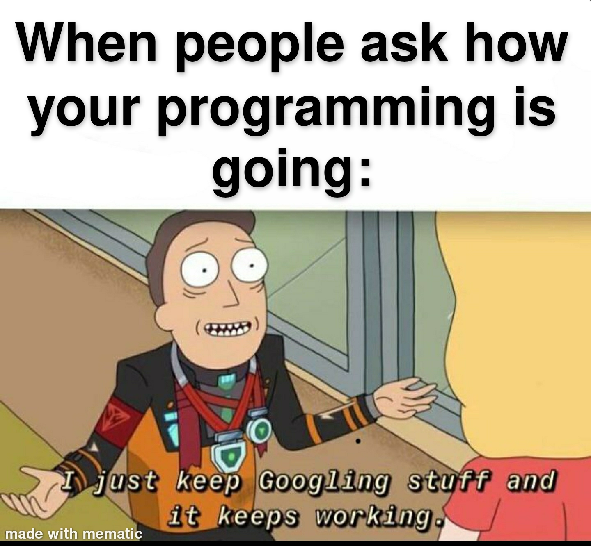

# QND Computer Science Day 6
Mark Schmidt

--- 

# Agenda

- Recap
  - Wordle
  - Lists and Strings
- Randomization
- Packages
---

# Randomization

```python
ice_creams = ["Vanilla", "Chocolate", "Cookies and Cream"]

# How to select a random item from this list?
```

<!-- -->
<!-- If I have a way to generate a random number, I could use it as a list index? -->

<!-- But how to get a random number? -->

---

# Google It

- Software Engineering is 90% Googling, 10% knowing what to google



---

# Introducing `import` 

```python
import random 
ice_creams = ["Vanilla", "Chocolate", "Cookies and Cream"]

print(f"My random ice cream is: {random.choice(ice_creams)}")
```

<!-- -->
<!-- Generally, put imports at the top of your file before any of your code -->

<!-- Show more complex example with checking a million generations -->
--- 

# Why do I need to `import`?

- Why isn't this code just included by default?
    - May not be present on certain machines
    - More inputs => more work for Python on startup
- Replit will manage your packages for you

---

# What else to `import`?

- We'll start using `import` a lot more
- Get access to high quality, well tested code


---
# Better Coloring

```python
import termcolor 

red_hello = termcolor.colored("hello", "red")
green_world = termcolor.colored("world", "green")

print(f"{red_hello} {green_world}")

```

<!-- -->
<!-- Note that we can accomplish the same import with import termcolor -->

---
# Project

- Use `random` to select a random word from a list of secret words
- https://tinyurl.com/qnd-wordle-2
- Bonus:
    - Use `termcolor` to color each letter appropriately
    - Ensure guess is 5 letters long

