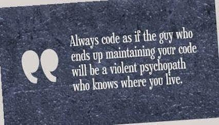

# QND Computer Science Day 9
Mark Schmidt

--- 

# Recap 

- Wordle
- Files

--- 

# Code Cleanliness

- Someone else might read your code one day
- Comments
- Variable names
- Organization and spacing



<!-- -->
<!-- Print is a function that does not return a value! -->
<!-- Input is a function that does not require arguments -->

---

# Functions!

- You've used functions already
- `print("something")`
- `input("prompt")`
- `open("file", "w")`
- `random.choice([1, 2, 3])`
- We can make our own!
---

# What does this output?

```python
def multiply_string(string):
    output = ""
    for i in range(3):
        output += string
    return output

print(multiply_string("🚀"))
print(multiply_string("🔥"))
```

<!-- -->

<!-- This is a contrived example -->

---

# Wordle Rubric

- Random word from word bank
- Repeatedly ask for guesses
- Grade with emoji or termcolor
- Accept only valid English words
- Exit when the user guesses correctly
- Add some comments to your code
- Bonus
    - Allow only 6 guesses
    - Use functions!
---

# Wordle 

- tinyurl.com/five-letters
- tinyurl.com/qnd-wordle-3

