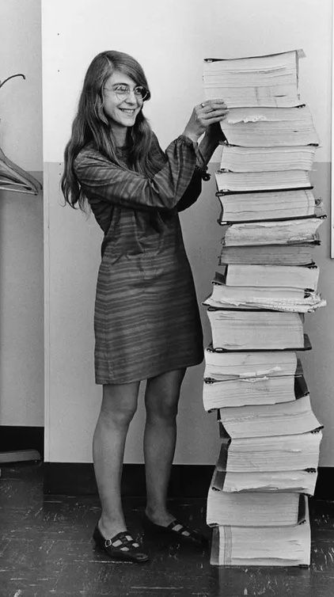

# QND Computer Science Day 3
Mark Schmidt

---

# Agenda

- Computer History (brief)
- An Unbelievable Fact
- Basic Math
- Project

---

# Math

- Early computers were made for math!
- Codebreaking
- Artillery Range Tables
- Aerodynamics


---

# Early Computers

- Before the machines, computer was a job!
- Largely held by women
- Margaret Hamilton with her Apollo Lunar Lander program



---

# Computer Programming

- Transitioning to physical computers was slow
- Women computers took advantage and gained engineering roles
- Judith Love Cohen


---

# Math and Computers Today

- Computers are constantly doing math
- Building modern programs requires a ton of math
- Video Games require the most complex math

---

# What does this do?

```swift
let a = 5
let b = 4

let result = a + b

print(result)
```
---

# The Square Calculator

- Ask the user for a number
- Square it and print the result

```swift
print("Enter a number to square: ")
let number = readLine()!

print(number * number)
```

---

# Types

- Strings
  - Sequence of characters
  - Can be empty
  - Put in quotes
  - Can be combined with other strings
- Integers
  - A number with no decimal

---

# The Square Calculator (fixed)

```swift
print("Enter a number to square: ")
let numberString = readLine()!
let number = Int(numberString)!

print(number * number)
```

---
# Decimals


- What will this do?
```swift
let a = 0.1
let b = 0.1
print(a + b)

```

<!-- -->
<!-- Show 0.1 + 0.1 = 0.2, 0.1 + 0.2 => 0.3000000004 -->

---

# This has caused a lot of problems

- Banks deal with decimals a lot!

```swift
let myBalance = 200.20
let purchasePrice = 100.20
let finalBalance = myBalance - purchasePrice
print(finalBalance)
```

---

# Types

- Strings
- Ints
- Floats
  - Store decimal values
  - Imprecise (be careful!)

---

# Project

Make a **calculator**

- Use `readLine()!` twice to get two integers 
- Don't forget `Int()!`

Compute the sum, print it out!

--- 

# Calculator Improvements

- Use `readLine()!` again to get an operation
- Add, Subtract, Multiply, Divide
- Use `if` to handle the operation

---

# Extra Challenges

1. Also print the difference (-)
2. Also print the product (*)
3. Also print the quotient (/)
4. Use `Floats` instead of ints
5. What happens if we divide by zero?