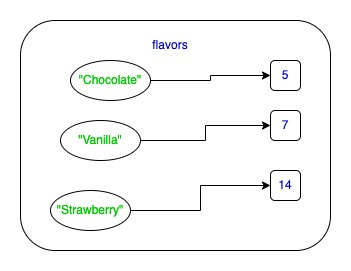
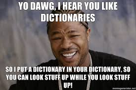

# QND Computer Science Day 9
Mark Schmidt

--- 

# Ballot Box 

```python

while True:
    flavor = input("Enter your favorite ice cream, or q to quit")
    if flavor == "q":
        break

    # TODO: save the flavors in a structure of some kind

# TODO display the top flavors

```

---

# Ballot Box

```python
chocolate = 0
vanilla = 0
while True:
    flavor = input("Enter your favorite ice cream, or q to quit")
    if flavor == "q":
        break
    elif flavor == "chocolate":
        chocolate += 1
    elif flavor == "vanilla":
        vanilla += 1

print(f"Chocolate: {chocolate}")
print(f"Vanilla: {vanilla}")
```


---

# Ballot Box 

```python

flavors = {} # Create an empty dictionary
while True:
    flavor = input("Enter your favorite ice cream, or q to quit")
    if flavor == "q":
        break
    if flavor not in flavors:
        flavors[flavor] = 0
    flavors[flavor] += 1

for flavor, count in flavors:
    print(f"There are {count} votes for {flavor}")

```

<!-- -->
<!-- Note that flavor, count is a TUPLE -->

---

# Dictionaries

- Sometimes called maps or hashmaps
- Establish a relationship between *key* and *value*
    - Keys must be unique
    - Value can be anything



---

# Dictionaries



- Lookup with `[]` like a list

--- 

# Project

- Continue Wordle
- Let the user play repeatedly
- Use a dictionary to track how many guesses it took for each secret word
- Print out the dictionary at exit
- Bonus:
    - Multiple word banks for different letter counts
