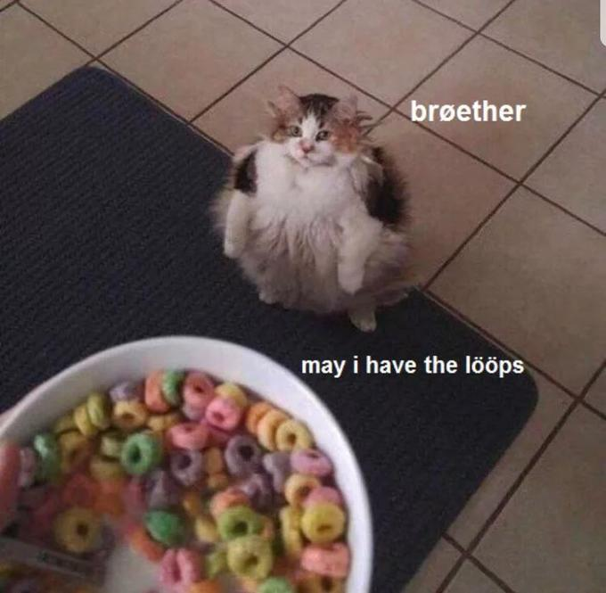
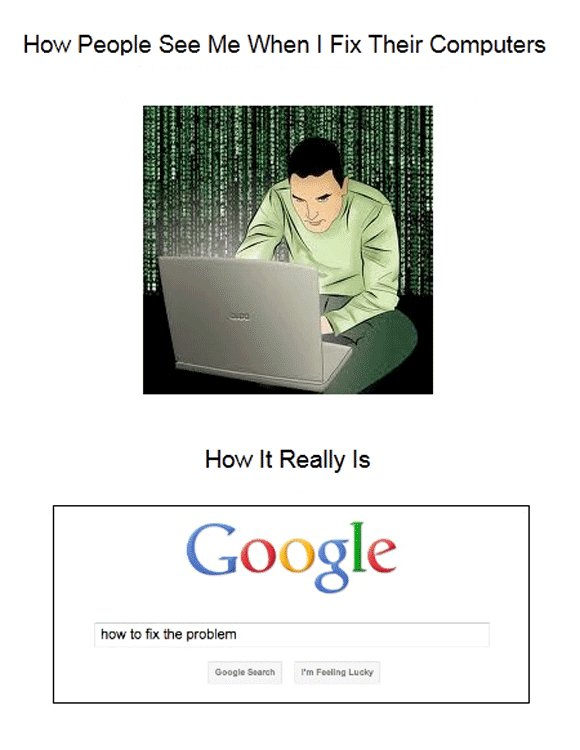

# QND Computer Science Day 9
Mr. Schmidt

--- 

# Agenda

- Recap
- Guess My Number Game
  - Greater than or less than
  - Loops
  - Color
  - Random number generation
  - `var`s

---

# Recap

- Calculator
- Math


---

# Guess My Number Game

- User guesses a number
- Tell them if they are high or low
- Repeat until they get it right

---

# Stage 1: Guess + Check

- Read a number from the user
- Check if it is equal, greater, or less than the secret number
- Print out a message

---

# > or <

```swift

if guess > secretNumber {
  console.write("Too high!")
}

```

---

# Stage 2: Repeat

- Use a `while true` loop
- Use a `break` statement
- Track guess count

---

# Loops

- `while` loops
  - We will use `while true` today
- `for loops`



<!-- -->

---

# While Loops

- `while true` will repeat forever

```swift
while true {
  console.write("This will repeat forever!")
}
```

---

# `break`

- Use `break` to exit a loop!

```swift
while true {
  let command = console.read("Enter a command")
  if command == "q" {
    break
  }
  // do something else
}

```

---

# `var`

```swift
var count = 0
```
- Read as "set variable count to 0"
```swift
count = count + 1
```
- Read as "set count to count + 1"

- `let` cannot be changed
- `var` can
---

# Stage 3: Miscellaneous Improvements

- Random number
- Color

---

# Random Numbers

- How do I generate a random number in Swift?
- You don't need to memorize everything!
- Let's Google it
- AI bots can also be useful



---

# Color

- New Type!
- `ColoredString`

```swift
let colored = ColoredString("This is blue", .blue)
console.write(colored)
console.write(ColoredString("This is red!", .red))
```

